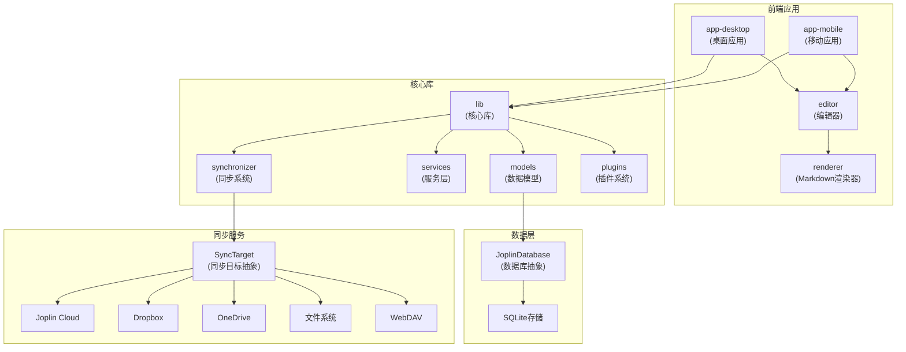
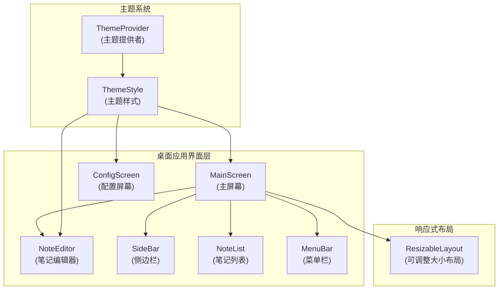
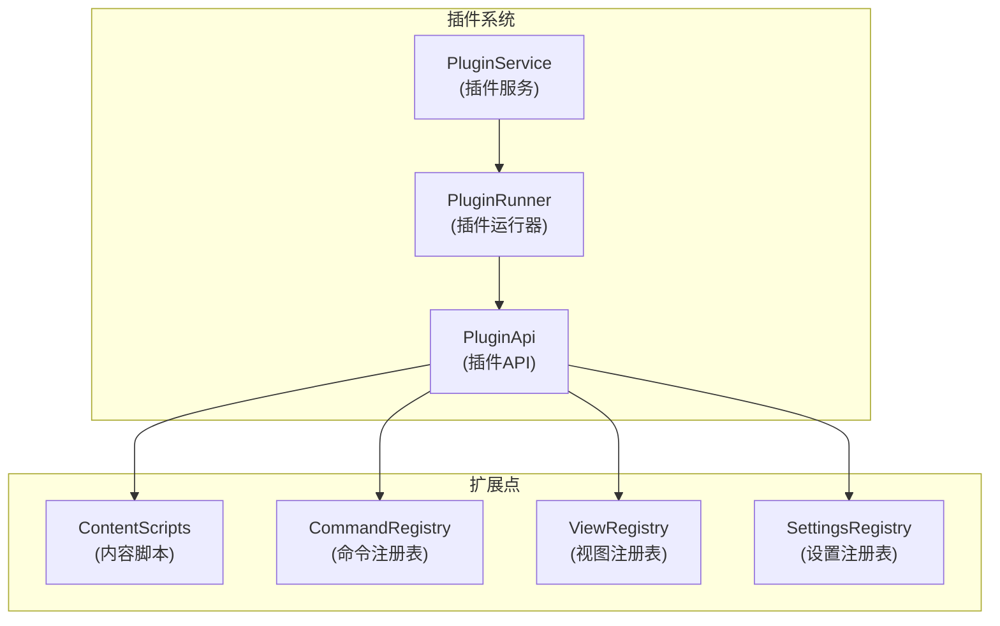

# Joplin组件关系图

以下是基于代码分析得出的Joplin主要组件关系图，使用Mermaid图表格式描述。

## 核心组件关系

## 桌面应用组件关系

## 插件系统

这些图表基于对源代码的分析，展示了Joplin的主要组件及其之间的关系。可以将这些Mermaid代码复制到支持Mermaid的Markdown查看器中渲染实际图表，或者使用在线Mermaid编辑器 (如https://mermaid.live) 进行可视化。 