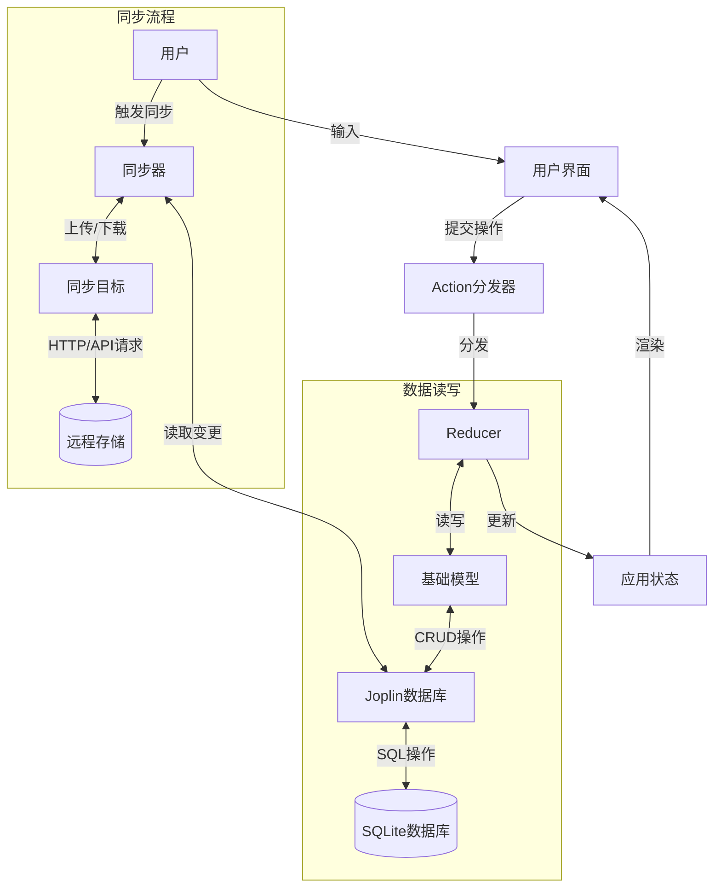
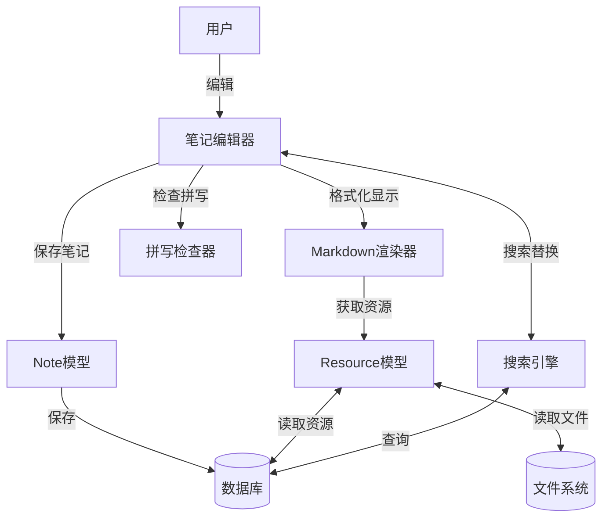
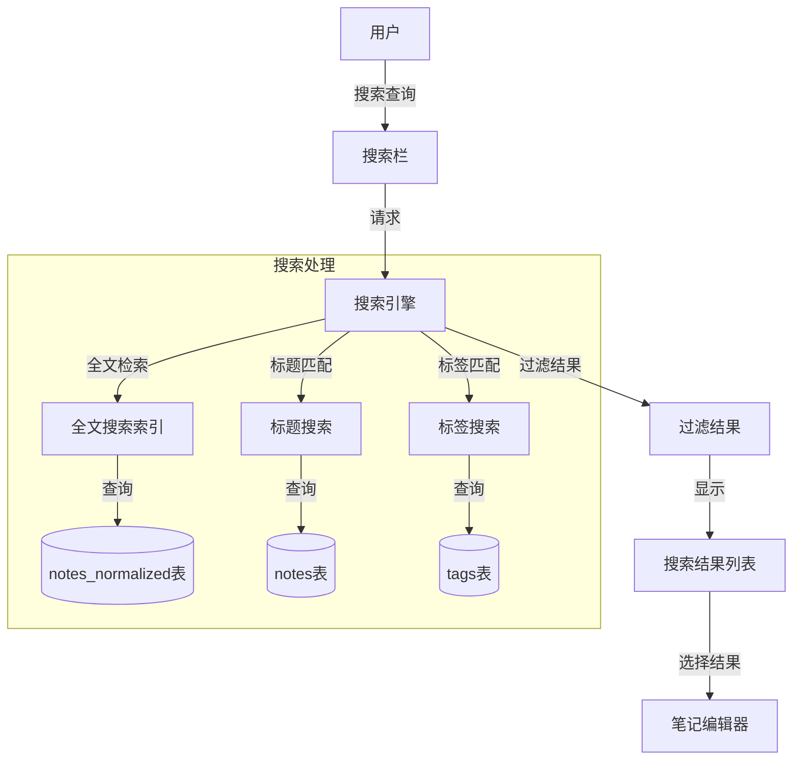
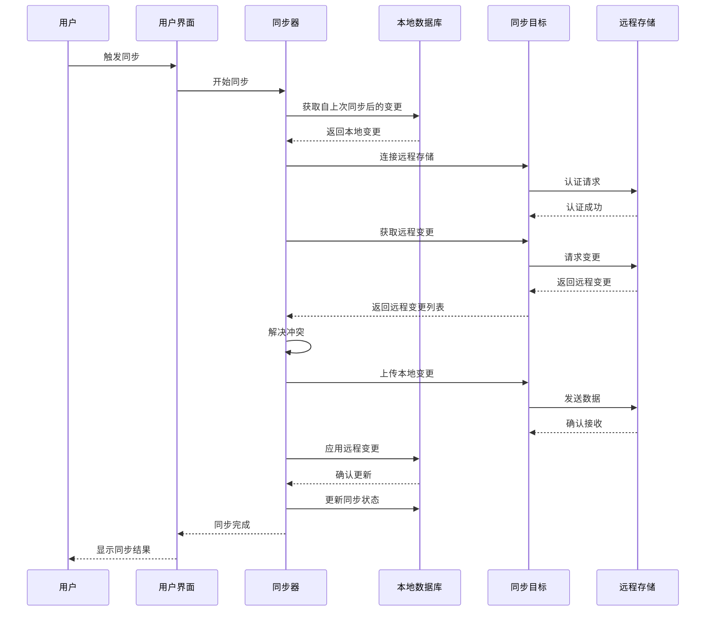

# Joplin数据流程图

以下是基于代码分析得出的Joplin主要数据流程图，使用Mermaid图表格式描述。

## 核心数据流

## 笔记编辑数据流

## 搜索流程

## 同步流程详细图

这些图表基于对源代码的分析，展示了Joplin的主要数据流程。可以将这些Mermaid代码复制到支持Mermaid的Markdown查看器中渲染实际图表，或者使用在线Mermaid编辑器 (如https://mermaid.live) 进行可视化。 