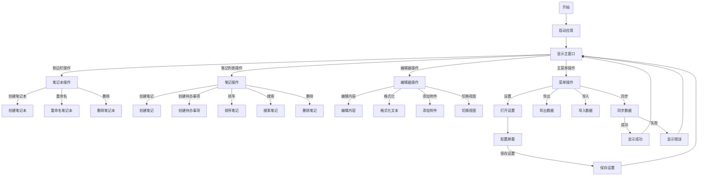
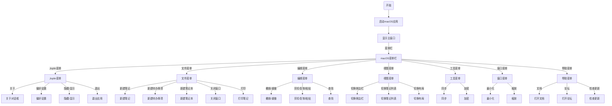
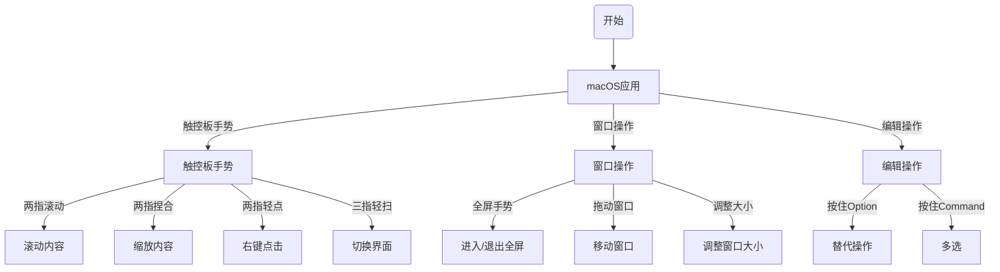
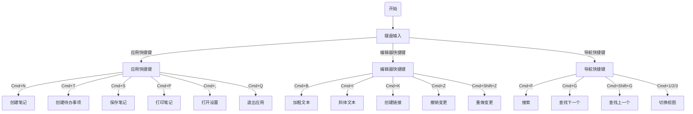

# Joplin用户交互流程图

以下是基于代码分析得出的Joplin主要用户交互流程图，使用Mermaid图表格式描述。

## 主要用户界面交互流程

## macOS交互流程

## 触控手势交互 (macOS)

## 键盘快捷键流程

这些图表基于对源代码的分析，展示了Joplin的主要用户交互流程，特别是macOS平台的特定交互。可以将这些Mermaid代码复制到支持Mermaid的Markdown查看器中渲染实际图表，或者使用在线Mermaid编辑器 (如https://mermaid.live) 进行可视化。 